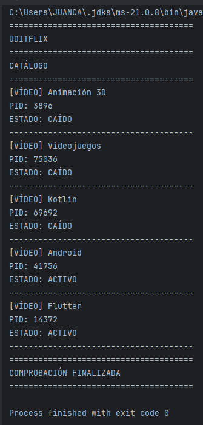

# Uditflix Monitor

Aplicación Java en consola para simular un monitor de catálogo de contenido de streaming. La aplicación revisa una lista de vídeos y comprueba si cada uno está activo o caído utilizando una comprobación por red (`ping`) a una IP ficticia o local.

## Captura

<p align="center">
  
</p>

## Descripción

Este proyecto muestra un catálogo de vídeos, cada uno con:

- nombre del contenido
- dirección IP de comprobación
- PID del proceso lanzado
- estado final: `ACTIVO` o `CAÍDO`

La lógica está implementada en `Main.java` y recorre una matriz de vídeos para comprobar el estado de cada uno mediante `ProcessBuilder` y el comando `ping` del sistema operativo.

## Funcionalidades

- Lista de vídeos con nombre e IP de verificación
- Comprobación de disponibilidad por red
- Visualización del estado del servicio
- Salida en consola con estilo tipo monitor

## Requisitos

- Java 21 o superior
- Maven

## Ejecución

1. Clona o descarga el proyecto.
2. Abre una terminal en la raíz del proyecto.
3. Ejecuta:

```bash
mvn compile
java -cp target/classes org.example.Main
```

## Estructura del proyecto

```text
reto01_monitor_uditflix/
├── src/
│   └── main/
│       └── java/
│           └── org/
│               └── example/
│                   └── Main.java
├── pom.xml
├── README.md
└── docs/
    └── images/
        └── uditflix-monitor.png
```

## Autor

Proyecto desarrollado como ejercicio de programación en Java para monitorizar el estado de un catálogo multimedia.
